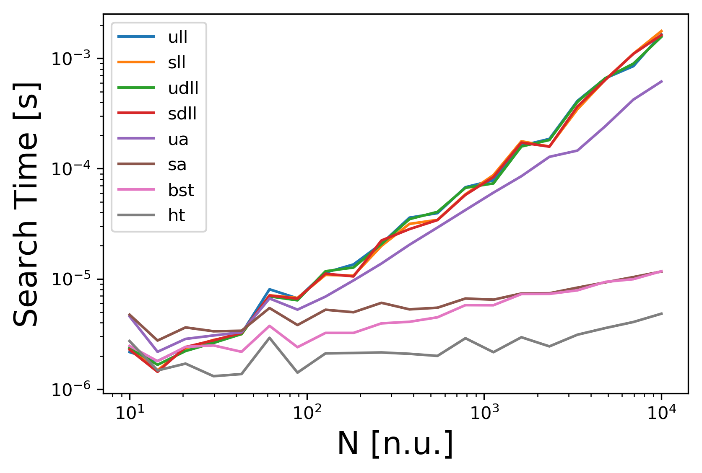
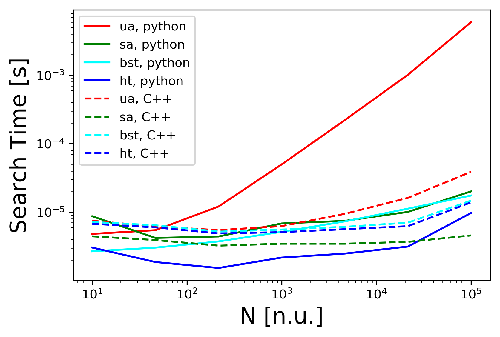

# Asymptotic Dictionary Search Time Study

The notebook `AsymptoticDictionarySearchTime.ipynb` compares the time complexity of the search operation for a dictionary using several different data structures as underlying implementations of the dictionary. The underlying implementations include:

 - Sorted and unsorted singly-linked lists
 - Sorted and unsorted doubly-linked lists
 - Sorted and unsorted arrays
 - Binary search trees
 - Hash tables

The comparison will be performed by randomly populating each data structure with a uniformly distributed sample of data ranging in size from $N=10 ... 10^{4}$. Search times will be compared by searching for data from the sample in each data structure and comparing the average search times for each value of $N$.

Additionally, implementations of arrays, binary search trees, and hash tables in `C++` and `python` will be compared to assess the relative speeds of the `C++` and `python` runtime environments.

## Requirements
 - `python 2.7`
 - `numpy`
 - `matplotlib`
 - `pybind11`
 - `cmake >=2.8.12`

## Getting Started

 - `$ ./build.sh` to compile the C++ source
 - `$ jupyter notebook` to run the simulation study notebook

## Study 1: Search Time Complexity under Different Dictionary Implementations

__Result Key:__

 - __sll__: sorted linked list
 - __ull__: unsorted linked list
 - __sdll__: sorted doubly linked list
 - __udll__: unsorted doubly linked list
 - __ua__: unsorted array
 - __sa__: sorted array
 - __bst__: binary search tree
 - __ht__: hash table

__Note__: Displayed results performed on a 2.8 GHz machine with 16 GB of memory.

### Analysis
The above results show that the hash table implementation has the lowest search time complexity of the dictionary implementations, with a $O(n/m)$ average complexity, where $m$ is the hash table size. Underlying data structures that allow binary search (e.g. the sorted array and binary search tree) give a $O(log(n))$ complexity. This beats the remaining implementations, which invariably require a linear search and therefore exhibit $O(n)$ time complexity for the search operation.

The results are tabulated below, which reproduces the search times listed in [1].

|Data Structure|  Time Complexity for Dictionary Search|
|---|---|
|Unsorted Array|             $O(n)$               |
|Sorted   Array|             $O(log(n))$          |
|Unsorted LL   |             $O(n)$               |
|Sorted   LL   |             $O(n)$               |
|Unsorted DLL  |             $O(n)$               |
|Sorted   DLL  |             $O(n)$               |
|Binary Search Tree|         $O(log(n))$          |
|Hash Table*    |             $O(n/m)$             |

*$m$ is the initialized size of the hash table. Time complexity is the expected search time using chaining with doubly linked lists to resolve collisions.

## Study 2: Dictionary Search Times  - Python and C++ Implementations

__Note__: Displayed results performed on a 2.8 GHz machine with 16 GB of memory.

### Analysis
The above results show that, as expected, the `C++` implementations have generally faster runtimes that the  `python` implementations for the search operation. Importantly, there is a close to 1000x speedup for the C++ unsorted array versus the python unsorted array for the search operation. Curiously, the C++ hash table is slower than the python hash table. This discrepancy may be due to the overhead incurred by the `pyBind` library, which is used to invoke the C++ executables from python.

### References

[1] S. Skiena, _The Algorithm Design Manual_, London: Springer-Verlag, 2011, pp. 74-75, 90
